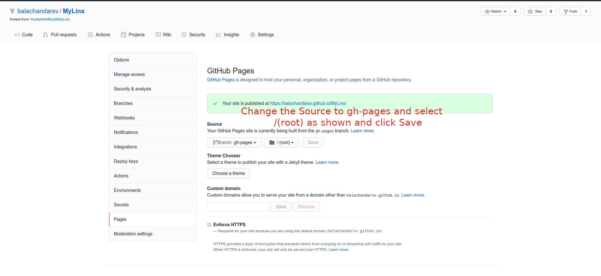

# MyLinx
## _A simple bio links tool for ***developers***_


MyLinx is an open source tool to create and host your bio links page in github. 

Looking for a demo ? 

[MyLinx Demo](https://youaskwebuild.github.io/MyLinx/)

[MyLinx Builder Demo](https://youaskwebuild.github.io/MyLinx/builder.html)

## Features

- Add unlimited links
- Search and filter 
- Add Social media links
- Customize your background
- Highlight links
- MyLinx Builder with live preview
- Save & Load your data in builder

## Built Using

MyLinx uses the following open source projects:

- [TailwindCSS] - Website is built using TailwindCSS!

And of course [MyLinx](https://github.com/YouAskWeBuild/MyLinx) itself is open source with a Apache 2.0 license on GitHub.


## Do you need one like the Demo for yourself ? 

Here is what you should do

- Fork the repository [MyLinx](https://github.com/youaskwebuild/MyLinx/fork)
- Go to Settings -> Pages -> Select **gh-pages** branch, **/root** in the next select folder and click on **Save**

   
- Your own site ([your-github-profile-name].github.io/MyLinx) will be up soon.

- You can either visit ([your-github-profile-name].github.io/MyLinx/builder.html) or visit [MyLinx Builder](https://youaskwebuild.github.io/MyLinx/builder.html) to add your own links to display on Mylinx.

- Once you are done, click on **Copy Data** button on the builder page. This will copy the links data to clipboard. 

- Now go to your repository and switch your branch to gh-pages

- Edit or Create a new file named **data.json** and replace the content with the clipboard content that was copied.

- That's it! Your website is now ready. You can add the link ([your-github-profile-name].github.io/MyLinx) now to your instragram bio or where ever you want.

- In case you want to add or remove, you can click on **Load Data** button and paste the content of your data.json and begin editing from there.


## Installation

### To run locally

MyLinx requires [Node.js](https://nodejs.org/) v14+ to run.

Clone this repository

Install the dependencies and devDependencies and start the server.

```sh
cd MyLinx
npm install
npm run start
```

For production environments...

```sh
npm install 
npm run build
```

## Plugins

MyLinx is currently extended with the following plugins.

| Plugin | Usage |
| ------ | ------ |
|Tailwind Forms | Forms in MyLinx builder are built using tailwind forms plugin 

## Contribute

Want to contribute? Great!

Fork the repository [MyLinx](https://github.com/youaskwebuild/MyLinx/fork)

Clone your forked repository
 
Make the changes to your clone and provide a PR! 


## License

Apache 2.0

**Free Software, Hell Yeah!**


   [TailwindCSS]: <https://github.com/tailwindlabs/tailwindcss>
   [Tailwind Forms]: <https://github.com/tailwindlabs/tailwindcss-forms>


## Authors

> Balachandar Sureshkumar
